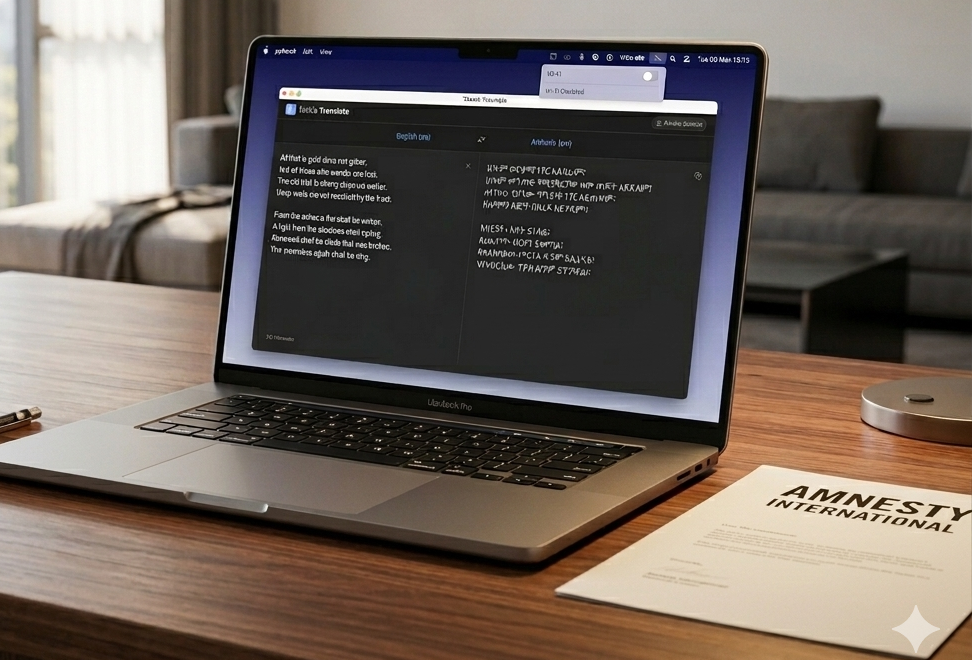
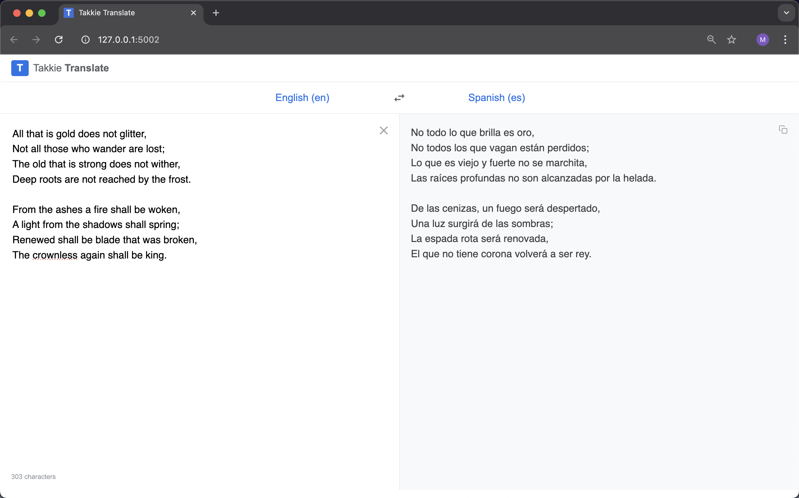
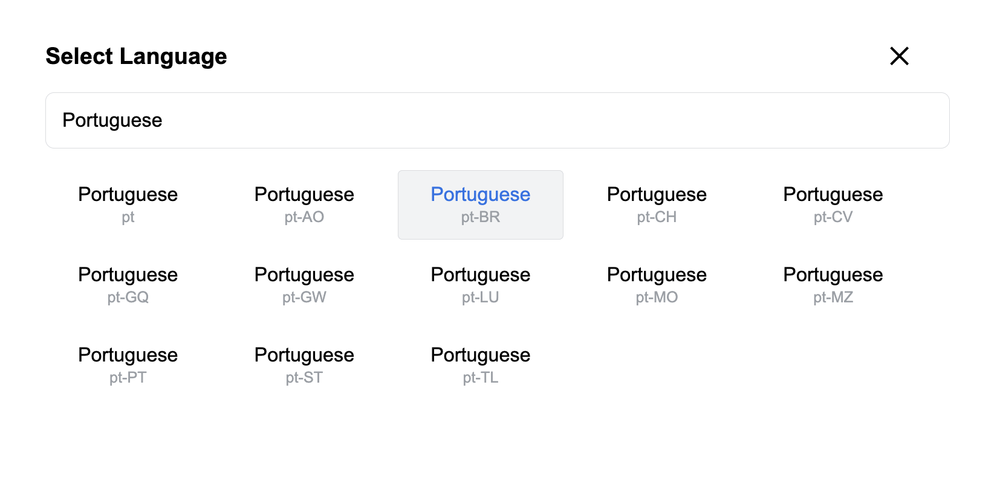

# Takkie Translate Offline

### Privacy-first text translation for macOS. Powered by Google TranslateGemma 12b.

Takkie Translate isn't just a simple wrapper around an LLM. It's a thoughtfully engineered solution for local AI translation - powered by TranslateGemma 12b Q4_K_M.

This project provides a template for packaging AI for use in places where there's no internet. It eliminates the "technical friction" usually associated with local LLMs by automating the entire environment setup - from port detection to model management. 

Takkie is essentially a portable, folder-based translation app that doesn't require complex system-wide installation.


<br>



<br>

- Double-click to run.
- Supports 55 languages and regional variants (e.g., pt-BR vs. pt-PT or zh-Hant vs. zh-Hans).
- Web based Flask app that looks and feels like a native macOS application.
- Your data never leaves your machine. Total privacy for sensitive work.
- Ephemeral data processing. No sensitive data is stored.
- Bundles all binary executables together with the app - including Ollama and the model.
- Copies of the installed app can be shared using a thumb-drive or AirDrop.
- All dependencies travel with the copy.
- Runs completely offline.
- Can be run on an external SSD.
- Runs in a virtual environment. Other software on the user's computer is not disturbed.
- Easy to audit by Human and AI. Uses a single-file architecture.


<br>

<p>GoogleTranslate style UI</p>
<br>


<p>Includes regional language variants</p>
<br>

## Security

- <strong>Strictly local network binding</strong> — Flask is hardcoded to bind on ```127.0.0.1``` only. A check_host() guard aborts the process immediately if any attempt is made to bind to a non-loopback address, making the app unreachable from other devices on the network.
Dynamic port assignment — Both the Flask server and the bundled Ollama instance use dynamically selected free ports rather than fixed, well-known ports, reducing the risk of port-squatting attacks and conflicts with other services.

- <strong>No data persistence</strong> — Translation input and output are processed ephemerally in memory. No user text, history, or session data is written to disk at any point.

- <strong>Input validation and allowlisting</strong> — The ```/translate``` endpoint validates source and target languages against a pre-loaded allowlist (```_VALID_LANG_PAIRS```) and enforces a 32,000-character input limit. Malformed or missing fields return a 400 error before any model interaction occurs.
  
- <strong>Strict HTTP security headers</strong> — Every response includes ```Content-Security-Policy``` (restricting resource loading to ```self```), ```X-Frame-Options: DENY```, ```X-Content-Type-Options: nosniff```, ```Referrer-Policy: no-referrer```, and a ```Permissions-Policy``` blocking camera, geolocation, and payment APIs.

- <strong>No caching of sensitive content</strong> — All responses include ```Cache-Control: no-store``` and ```Pragma: no-cache``` to prevent translation content from being stored by the browser or any intermediary cache.

- <strong>Bundled, isolated Ollama binary</strong> — The app uses its own bundled Ollama binary pointed at a project-local model directory, preventing cross-contamination with any system-level Ollama installation or models.
  
- <strong>Incognito WebView</strong> — The app window opens with ```private_mode=True```, so no cookies, browsing history, or cached data persists after the session ends. This also prevents the WebView from inheriting state from other browser sessions on the machine.
  
- <strong>Isolated virtual environment</strong> — The app runs in a self-contained Python virtual environment, ensuring it cannot interfere with or be affected by other software on the user's system.

- <strong>Auditable single-file architecture</strong> — All application logic lives in a single ```app.py```, making the full codebase straightforward for users or security reviewers to inspect in its entirety.

## Data Hygiene Best Practices

Even with a secure app, "Human Error" can leave trails. Please follow these rules:

- <strong>The Clipboard Rule</strong>: If you "Copy" a sensitive translation to paste into a report, that text stays in the Mac’s "Clipboard" (the temporary memory).<br>
Safety Tip: After you finish your work, copy a random, non-sensitive word (like the word "Orange") to "bump" the sensitive text out of the computer's memory.

- <strong>The USB Rule</strong>: If you are running the app from a thumb drive, always "Eject" the drive properly before unplugging it. This ensures the temporary "Virtual Environment" closes correctly and leaves no fragments on the host Mac.


<br>

## System Requirements

To ensure optimal performance, your system should meet the following specifications:

- Operating System: macOS
- Processor: Apple Silicon (M1, M2, M3, etc.)
- Memory: 16 GB RAM
- Storage: 8.5 GB free disk space

<br>

## Where to download

The project folder is stored as a HuggingFace dataset. Hugging Face automatically generates SHA256 hashes for every file in a dataset repository.<br>
Please click this link to auto download:<br>
https://huggingface.co/datasets/vbookshelf/Takkie-Translate-Offline-TDA/resolve/main/Takkie-Translate-v3.0-TDA.zip?download=true

<br>

## How to install

1. Download the Takkie-Translate-v3.0-TDA.zip file and unzip
2. Place the unzipped folder on your desktop. Then open the terminal and cd into the Takkie-Translate-v3.0-TDA folder:
   ```
   cd Desktop/Takkie-Translate-v3.0-TDA
   ```
3. MacOS often quarantines downloaded files. To make the launch script executable, paste this command into the terminal and press Enter:
```
cat start-mac-app.command > temp && mv temp start-mac-app.command && chmod +x start-mac-app.command
```
4. Open the Takkie-Translate-v3.0-TDA folder and double-click this file: <strong>start-mac-app.command</strong><br>
If a MacOS security popup appears, click: "Allow"


5. The app will open. This may take a few seconds. Please be patient if you don't see anything happening. During normal use the app will open much faster. Because the model needs to load, it may take a few seconds to get a response to your first message. Subsequent responses will be much faster.


<br>

## References

- Thumb-Drive-App-Concept<br>
https://github.com/vbookshelf/Thumb-Drive-App-Concept

- Single-File Architecture: One file to rule them all<br>
https://github.com/vbookshelf/Single-File-Flask-Web-App

- pywebview<br>
https://github.com/r0x0r/pywebview

- Ollama - translategemma:12b<br>
  https://ollama.com/library/translategemma:12b

<br>

## Revision History

Version 3.0<br>
18-March-2026<br>
Prototype. Released for testing.<br>
- Bundled the Python 3.12 interpreter.
- Bundled the wheels for all packages.
- Added a venv token system that deletes a venv that may have been shipped with the app.
- Modified the code so that the app can only use the bundled uv.

Version 2.0<br>
15-March-2026<br>
Prototype. Released for testing.<br>
- Fixed a bug. When multiple apps were open, closing one app resulted in the code trying to close all open apps. Now multiple TDAs can be used at the same time.
- Previously, if the app detected that the model was missing during startup, it would auto download the model. Now auto download is disabled. It can be enabled by setting ALLOW_MODEL_DOWNLOAD=1 in the start-mac-app.command file.

Version 1.0<br>
5-March-2026<br>
Prototype. Released for testing.

<br>

